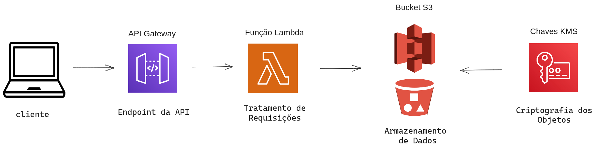

# ServerlessCloudTransactionLogging
Sistema de registro de logs de transações de uma empresa utilizando IaC para subir uma infraestrutura na AWS. Feito para entrega final da disciplina Computação em Nuvem, do 6° semestre do Insper

## Overview da Aplicação: 
Esse projeto introdutório de Terraform + AWS busca simular o registro de logs de transações de clientes de uma empresa utilizando as seguintes tecnologias da Amazon:
	
- S3 - Utilizado para fazer o armazenamento dos arquivos
- KMS - Criptografa e descriptografa os logs do S3
- API Gateway - Fornece endpoint e ativa o Lambda para fazer operações com os arquivos
- Lambda - Faz o POST e o GET de arquivos

A ideia principal por trás desse projeto é utilizar um framework de API *serverless*, isto é, sem precisar subir e manejar uma instância (EC2, por exemplo). Ao invés disso, a própria provedora (no caso a AWS) aloca recursos para aplicação automaticamente, reduzindo potenciais problemas de escalabilidade.

## Esquema da Infraestrutura

## Pré-Requisitos
 - Uma conta na AWS
 - Terraform
 - AWS CLI
 - Postman (apenas para teste)

## Rodando a Infraestrutura

1. Exportar chaves da sua conta AWS
`export AWS_ACCESS_KEY_ID=<SUA CHAVE DE ACESSO>`
`export AWS_SECRET_ACCESS_KEY=<SUA CHAVE DE ACESSO>`

