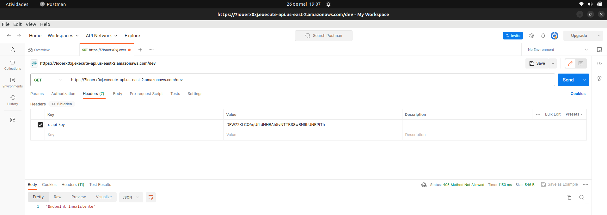
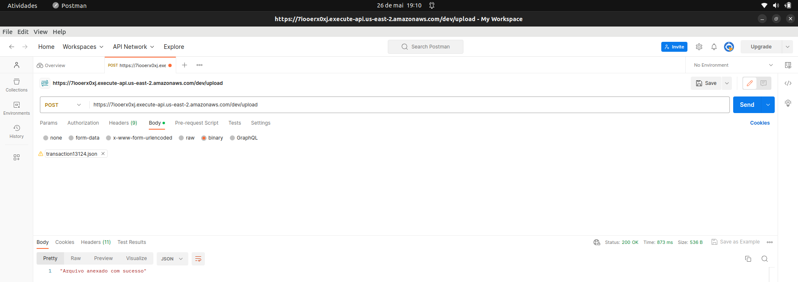

# ServerlessCloudTransactionLogging
Sistema de registro de logs de transações de uma empresa utilizando IaC para subir uma infraestrutura na AWS. Feito para entrega final da disciplina Computação em Nuvem, do 6° semestre do Insper.

Esse README busca tanto explicar as configurações necessárias para subir a infraestrutura e testá-la. Para entender o código em si, leia o [README](./terraform/README.md) da pasta `./terraform`

## Overview da Aplicação: 
Esse projeto introdutório de Terraform + AWS busca simular o registro de logs de transações de clientes de uma empresa utilizando as seguintes tecnologias da Amazon:
	
- S3 - Utilizado para fazer o armazenamento dos arquivos
- KMS - Criptografa e descriptografa os logs do S3
- API Gateway - Fornece endpoint e ativa o Lambda para fazer operações com os arquivos
- Lambda - Faz o POST e o GET de arquivos

A ideia principal por trás desse projeto é utilizar um framework de API *serverless*, isto é, sem precisar subir e manejar uma instância (EC2, por exemplo). Ao invés disso, a própria provedora (no caso a AWS) aloca recursos para aplicação automaticamente, reduzindo potenciais problemas de escalabilidade.

## Esquema da Infraestrutura


## Pré-Requisitos
 - Uma conta na AWS
 - Terraform
 - AWS CLI
 - Postman (apenas para teste)

## Subindo a Infraestrutura (Linux)

No terminal:

1. **Exportar chaves da sua conta AWS**

```sh
export AWS_ACCESS_KEY_ID=<SUA CHAVE DE ACESSO>
```

```sh
export AWS_SECRET_ACCESS_KEY=<SUA CHAVE DE ACESSO>
```

Esses comandos criam variáveis de ambiente que são acessadas pelo Terraform para fazer a conexão com a sua conta da AWS. Elas são temporárias - só duram enquanto o terminal utilizado estiver aberto - então é necessário rodá-lo toda vez que se abrir um terminal novo.

2. **Preparar Ambiente**

Execute os comandos abaixos na pasta `terraform`

```sh
terraform init
```

Configura o ambiente de trabalho do Terraform, garantindo que todos os componentes necessários estejam prontos para serem usados antes de começar a criação ou gerenciamento da infraestrutura na AWS.

1. **Subir infraestrutura**

 ```sh
terraform apply
```

Efetivamente executa a criação ou modificação da infraestrutura na nuvem com base nos arquivos de configuração do Terraform.

4. **Escolher nome do bucket**

O terraform permite que você utilize valores digitados pelo usuário como variáveis dentro do código. No caso, utilizo uma variável para que o usuário escolha o *nome* do bucket S3.

 ```sh
var.bucket_name
  Nome desejado pro S3 Bucket

  Enter a value: <NOME DO BUCKET>
```

Depois disso, o terraform dá um overview das operações a serem executadas e pede uma confirmação do usuário antes que ele prossiga. Dê uma olhada nas operações e, se tudo parecer correto, digite `yes` no terminal.

## Utilizando a Infraestrutura

O terraform também dá a possibilidade de *devolvermos* variáveis para o usuário. Depois de subir a infraestrutura, o terraform deve enviar uma mensagem como a seguinte:

 ```sh
Apply complete! Resources: 22 added, 0 changed, 0 destroyed.

Outputs:

api-key = "DFW72KLCQAqUfLdNHBAh5vNTTBS8wBN9hUNRPtTh"
api-url = "https://7iooerx0xj.execute-api.us-east-2.amazonaws.com/dev"
```

`api-url` é o domínio criado pelo API Gateway e é onde faremos as nossas requisições

`api-key` é a **chave** da API, devendo ser enviada junto a toda requisição ao API Gateway como forma de autenticação

### Endpoints da API

A API criada é simples e possui apenas três endpoints:

1. **Recuperar todas as transações**
 - Método: GET
 - URL: /transactions
 - Descrição: Retorna a lista de todos os arquivos de transação disponíveis.
 - Resposta:
 - Código de status: 200 (OK)
 - Corpo da resposta: Lista de nomes de arquivo de transação em formato JSON
  
2. **Recuperar uma transação específica**
 - Método: GET
 - URL: /transactions?transactionId={id}
 - Descrição: Retorna o arquivo de log de uma transação específica com base no ID fornecido.
 - Parâmetros de consulta:
 - transactionId: O ID da transação desejada.
 - Corpo da resposta: Dados da transação em formato JSON
 - Possíveis códigos de status:
   - 200 (OK): Transação encontrada e retornada com sucesso.
   - 404 (Not Found): Transação não encontrada.

3. **Enviar um arquivo de transação**
 - Método: POST
 - URL: /upload
 - Descrição: Envia um novo arquivo de transação para ser armazenado.
 - Corpo da solicitação: Dados da transação em formato JSON
 - Resposta:
 - Código de status: 200 (OK)
 - Corpo da resposta: Mensagem de sucesso

### Testando a API

Uma possibilidade para fazer todos os tipos de requisição para a API é utilizar o *Postman*.

Crie um novo arquivo para requisições HTTP e cole a URL fornecida como output do Terraform. Para qualquer tipo de requisição, é necessário especificar a API Key nos Headers, como a seguir:



Para a requisição do tipo POST, é necessário anexar o arquivo a ser enviado como binário, como a seguir:

